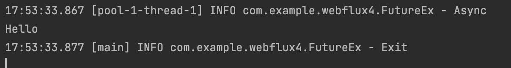

#1. 자바   
   
##1-1. 비동기를 사용하지 않는 기본적인 실행방식   
```Java
@Slf4j
public class FutureEx {
    public static void main(String[] args) throws InterruptedException {

        ExecutorService es = Executors.newCachedThreadPool();
        
        Thread.sleep(2000);
        System.out.println("Hello");

        System.out.println("Exit");
    }
}

```
   
   
   
##1-2. 비동기를 이용한 실행 방식   
   
- CachedThreadPool   
Thread를 만들고 폐기하는것은 상당히 큰 비용이 든다.   
Thread를 천번을 사용해야 되는데 동시에 10개밖에 사용을 안한다.   
기존의 방식을 이용하면 1000개의 Thread를 만들게 된다.   
   
CachedThreadPool을 이용하면 Thread 개수 제한이 없다.   
초기 스레드가 하나도 없고 요청할때마다 새로 만든다.   
다 사용한 Thread를 반납하면 새로 들어오는 요청에 Thread를 준다.   
   
- es.execute   
인자값이 Runnable.   
Runnable은 return 값이 없다.   
   
```Java
@Slf4j
public class FutureEx {
    public static void main(String[] args) throws InterruptedException {

        ExecutorService es = Executors.newCachedThreadPool();

        es.execute(() -> {
            try {
                Thread.sleep(2000);
            } catch (InterruptedException e) {}
            log.info("Async");
        });

        log.info("Exit");
    }
}

```
   
   
   
##1-3. Future 사용   
   
- Future    
비동기적인 작업을 수행하고 난 결과를 나타낸다.   
비동기적인 무엇인가가 연산 혹은 작업을 수행할 때 그에 대한 결과를 가지고 있는 것이다.   
비동기작업을 수행한다 -> 새로운 스레드에서 별개의 작업을 수행시킨다.   
작업의 결과를 다른 스레드로 전해주기 위해 사용되는 인터페이스가 Future이다.   
   
- es.submit   
인자로 Callable을 받는다.   
Callable은 Runnable과 달리 return 값이 있고, exception을 잡아준다.   
   
- Future get()   
결과가 나올 때 까지 Blocking한다.   
   
```Java
@Slf4j
public class FutureEx {
    public static void main(String[] args) throws InterruptedException, ExecutionException {
        ExecutorService es = Executors.newCachedThreadPool();

        Future<String> f = es.submit(() -> {
            Thread.sleep(2000);
            log.info("Async");
            return "Hello";
        });

        System.out.println(f.get());
        log.info("Exit");

    }
}
```
   
   
   
```Java
@Slf4j
public class FutureEx {
    public static void main(String[] args) throws InterruptedException, ExecutionException {
        ExecutorService es = Executors.newCachedThreadPool();

        Future<String> f = es.submit(() -> {
            Thread.sleep(2000);
            log.info("Async");
            return "Hello";
        });

        log.info("Exit");

        System.out.println(f.get());

    }
}
```
   
   
   
- Future isDone()   
blocking하지 않는다   
   
```Java
@Slf4j
public class FutureEx {
    public static void main(String[] args) throws InterruptedException, ExecutionException {
        ExecutorService es = Executors.newCachedThreadPool();

        Future<String> f = es.submit(() -> {
            Thread.sleep(2000);
            log.info("Async");
            return "Hello";
        });

        System.out.println(f.isDone());
        Thread.sleep(2100);
        log.info("Exit");
        System.out.println(f.isDone());

        System.out.println(f.get());

    }
}
```
   
   
   
이전 코드와 같은 동작   
   
- FutureTask   
future 자체를 Object로 만든 것   
   
```Java
@Slf4j
public class FutureEx {
    public static void main(String[] args) throws InterruptedException, ExecutionException {
        ExecutorService es = Executors.newCachedThreadPool();

        FutureTask<String> f = new FutureTask<String>(() -> {
            Thread.sleep(2000);
            log.info("Async");
            return "Hello";
        });

        es.execute(f);

        System.out.println(f.isDone());
        Thread.sleep(2100);
        log.info("Exit");
        System.out.println(f.isDone());

        System.out.println(f.get());

    }
}
```
   
   
   
##1-4. Callback 방식   
   
- done()   
비동기 작업이 다 완료되면 호출되는 hook 같은 것   
   
```Java
@Slf4j
public class FutureEx {
    public static void main(String[] args) throws InterruptedException, ExecutionException {
        ExecutorService es = Executors.newCachedThreadPool();

        FutureTask<String> f = new FutureTask<String>(() -> {
            Thread.sleep(2000);
            log.info("Async");
            return "Hello";
        }) {
            @Override
            protected void done() {
                try {
                    System.out.println(get());
                } catch (InterruptedException e) {
                    e.printStackTrace();
                } catch (ExecutionException e) {
                    e.printStackTrace();
                }
            }
        };

        es.execute(f);
        es.shutdown();

    }
}
```
   
   
   
위와 동일한 기능   
   
```Java
@Slf4j
public class FutureEx {
    interface SuccessCallback {
        void onSuccess(String result);
    }

    public static class CallbackFutureTask extends FutureTask<String> {
        SuccessCallback sc;
        public CallbackFutureTask(Callable<String> callable, SuccessCallback sc) {
            super(callable);
            this.sc = Objects.requireNonNull(sc);
        }

        @Override
        protected void done() {
            try {
                sc.onSuccess(get());
            } catch (InterruptedException e) {
                e.printStackTrace();
            } catch (ExecutionException e) {
                e.printStackTrace();
            }
        }
    }

    public static void main(String[] args) throws InterruptedException, ExecutionException {
        ExecutorService es = Executors.newCachedThreadPool();

        CallbackFutureTask f = new CallbackFutureTask(() -> {
            Thread.sleep(2000);
            log.info("Async");
            return "Hello";
        }, System.out::println);

        es.execute(f);
        es.shutdown();

    }
}
```
   
   
   
exception도 인자로 받음   
   
```Java
@Slf4j
public class FutureEx {
    interface SuccessCallback {
        void onSuccess(String result);
    }

    interface ExceptionCallback {
        void onError(Throwable t);
    }

    public static class CallbackFutureTask extends FutureTask<String> {
        SuccessCallback sc;
        ExceptionCallback ec;

        public CallbackFutureTask(Callable<String> callable, SuccessCallback sc, ExceptionCallback ec) {
            super(callable);
            this.sc = Objects.requireNonNull(sc);
            this.ec = Objects.requireNonNull(ec);
        }

        @Override
        protected void done() {
            try {
                sc.onSuccess(get());
            } catch (InterruptedException e) {
                Thread.currentThread().interrupt();
            } catch (ExecutionException e) {
                ec.onError(e.getCause());
            }
        }
    }

    public static void main(String[] args) throws InterruptedException, ExecutionException {
        ExecutorService es = Executors.newCachedThreadPool();

        CallbackFutureTask f = new CallbackFutureTask(() -> {
            Thread.sleep(2000);
            if(1 == 1) throw new RuntimeException("Async ERROR!!!");
            log.info("Async");
            return "Hello";
        },
                s -> System.out.println("Result: " + s),
                e -> System.out.println("Error: " + e.getMessage()));

        es.execute(f);
        es.shutdown();

    }
}
```
   
   
   
#2. 스프링   
   
##2-1. Future를 사용한 비동기 방식   
   
```Java
@SpringBootApplication
@Slf4j
@EnableAsync
public class Webflux4Application {

    @Component
    public static class MyService {
        @Async
        public Future<String> hello() throws InterruptedException {
            log.info("hello()");
            Thread.sleep(2000);
            return new AsyncResult<>("Hello");
        }
    }

    public static void main(String[] args) {

        try(ConfigurableApplicationContext c = SpringApplication.run(Webflux4Application.class, args)) {

        }
    }

    @Autowired MyService myService;

    @Bean
    ApplicationRunner run() {
        return args -> {
            log.info("run()");
            Future<String> f = myService.hello();
            log.info("exit: " + f.isDone());
            log.info("result: " + f.get());
        };
    }

}
```
   
   
   
##2-2. ListenableFuture를 사용한 Callback 방식   
   
```Java
@SpringBootApplication
@Slf4j
@EnableAsync
public class Webflux4Application {

    @Component
    public static class MyService {
        @Async
        public ListenableFuture<String> hello() throws InterruptedException {
            log.info("hello()");
            Thread.sleep(2000);
            return new AsyncResult<>("Hello");
        }
    }

    public static void main(String[] args) {

        try(ConfigurableApplicationContext c = SpringApplication.run(Webflux4Application.class, args)) {

        }
    }

    @Autowired MyService myService;

    @Bean
    ApplicationRunner run() {
        return args -> {
            log.info("run()");
            ListenableFuture<String> f = myService.hello();
            f.addCallback(s -> System.out.println(s), e -> System.out.println(e.getMessage()));
            log.info("exit");
        };
    }

}
```
   
   
   
##2-3. ThreadPoolTaskExecutor로 스레드 설정   
   
실전에서는 @Async를 그대로 사용하게 되면 스레드가 필요할 때마다 계속해서 생성해서 사용하게 된다. - 너무 비효율적이다.   
ThreadPoolTaskExecutor Bean을 생성해 스레드 관련 설정을 해 줄 수 있다.   
[관련 링크](https://docs.spring.io/spring-framework/docs/current/javadoc-api/org/springframework/scheduling/concurrent/ThreadPoolTaskExecutor.html)   
   
```Java
@SpringBootApplication
@Slf4j
@EnableAsync
public class Webflux4Application {

    @Component
    public static class MyService {
        @Async("tp")
        public ListenableFuture<String> hello() throws InterruptedException {
            log.info("hello()");
            Thread.sleep(2000);
            return new AsyncResult<>("Hello");
        }
    }

    @Bean
    ThreadPoolTaskExecutor tp() {
        ThreadPoolTaskExecutor te = new ThreadPoolTaskExecutor();
        // 첫 번째 스레드 요청이 오면 그 시점에서 size만큼 스레드를 만들어줌
        te.setCorePoolSize(10);
        // queue가 꽉 찼을 때 추가적으로 더 내어줄 수 있는 스레드의 수
        te.setMaxPoolSize(100);
        te.setQueueCapacity(200);
        te.setThreadNamePrefix("mythread");
        te.initialize();
        return te;
    }

    public static void main(String[] args) {

        try(ConfigurableApplicationContext c = SpringApplication.run(Webflux4Application.class, args)) {

        }
    }

    @Autowired MyService myService;

    @Bean
    ApplicationRunner run() {
        return args -> {
            log.info("run()");
            ListenableFuture<String> f = myService.hello();
            f.addCallback(s -> System.out.println(s), e -> System.out.println(e.getMessage()));
            log.info("exit");
        };
    }

}
```
   
   